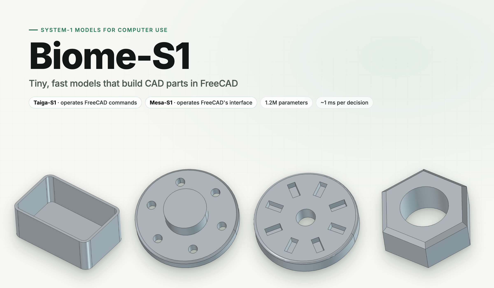
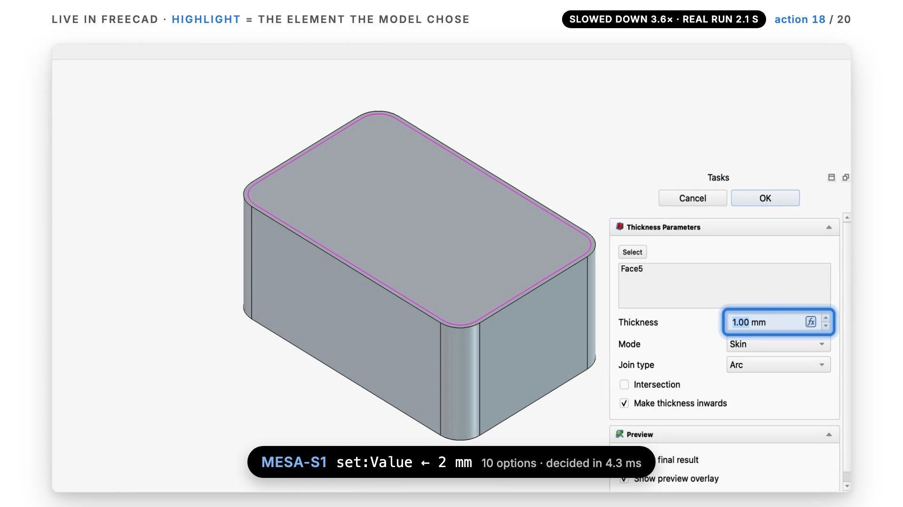

# Biome-S1



[](release/mesa-s1/assets/teaser.mp4)

**A family of tiny, fast "System 1" models for computer-use agents.**

*Biome-S1 is an experiment in whether small, fast decision models can be useful for computer-use agents: a planner decides what to do, and a tiny model handles the step-by-step execution. FreeCAD is the testbed. The next step is the same approach for applications without a scripting API, using the operating system's accessibility tree as the interface.*

You give a Biome-S1 model a goal, an ordered list of features like *"plate 40×30×10 → Ø6 hole at (10, 0) → polar pattern ×6 → fillet the top edges"*. It builds the part step by step. At every step it reads FreeCAD's live state and scores the actions currently available, in a single forward pass (~1 ms on CPU). No LLM, no vision model, no screenshots.

| Model | What it operates | Size | Held-out parts built correctly, and cleanly | Weights |
|---|---|---|---|---|
| **Taiga-S1** | FreeCAD **commands**: it picks the next command (sketch, pad, pattern, ...) and the runtime fills in each command's dialog | 1.2M params | 90–100% per suite (100% on every length suite) | [huggingface.co/shhivv/taiga-s1](https://huggingface.co/shhivv/taiga-s1) · [`release/hf`](release/hf) |
| **Mesa-S1** | FreeCAD's **interface**: toolbar buttons, dialog fields, dropdowns, check boxes, OK and Cancel | 1.2M params | 97–100% per suite | [`release/mesa-s1`](release/mesa-s1) |

Mesa-S1 does everything Taiga-S1 does, through the interface a person uses: where Taiga-S1 says "Pad", Mesa-S1 clicks the Pad button, types the length into the dialog, picks "Through all" from the dropdown when a pocket should cut through, clicks OK, and cancels or undoes when it went wrong. Both models:

- **Handle longer goals than they trained on.** Trained on goals of up to 5 features, they build 97–100% of 11-feature goals cleanly (~55 commands for Taiga-S1, ~80+ interface steps for Mesa-S1). Taiga-S1 also builds 95% of 17-feature goals.
- **Recover from mistakes.** With 20% of their actions replaced by random ones, they notice the damage and still build the right part in 88–100% (Taiga-S1) and 92–100% (Mesa-S1) of cases. Taiga-S1 also cleans up after itself; Mesa-S1 more often leaves a stray object behind on long goals (see Results).
- **Handle unseen combinations.** On held-out feature pairings that never appear in training: 90–100% (Taiga-S1, three pairings), 99–100% (Mesa-S1, two pairings).
- **Drive the real FreeCAD app** over a local socket and build parts live.

The Python package is named `freecad_s1`.

## Results


Built correctly *and cleanly* (the final solid matches the target and no stray objects are left in the document), with the looser "right part" rate in brackets where it differs:

| Goal | Taiga-S1 | Mesa-S1 | Taiga-S1, 20% random actions | Mesa-S1, 20% random actions |
|---|---|---|---|---|
| Parts like the training set (levels 1 / 2 / 3) | 100 / 100 / 100% | 100 / 100 / 99% (100) | 100 / 93 / 95% (100 / 98 / 98) | 99 / 98 / 85% (100 / 99 / 98) |
| Held-out feature combinations (never seen in training) | 90 / 100 / 100% | 99 / 100% (100 / 100) | 95 / 94 / 97% (96 / 95 / 99) | 89 / 95% (100 / 98) |
| 6–7 features | 100% | 97% (100) | 86% (88) | 74% (97) |
| 8–9 features | 100% | 99% | 87% (97) | 70% (95) |
| 11 features | 100% | 97% (99) | 90% (95) | 55% (92) |
| 13 / 15 / 17 features | 100 / 100 / 95% | – | – | – |

"Built correctly" means the model emitted `Done` and the final solid matches the target (volumetric IoU ≥ 0.99); "cleanly" means no stray objects remain. Rows are 100 fresh synthetic goals (same feature vocabulary as training, longer or recombined) in FreeCAD 1.1, except the 13–17-feature row, which is 60 per length; the unseen-combination row covers three held-out pairings for Taiga-S1 and two for Mesa-S1. Taiga-S1 runs against FreeCAD's API; Mesa-S1 runs through the FreeCAD GUI. Per-step accuracy against the teacher's choices: 99.8% (Taiga-S1), 99.86% (Mesa-S1). The evidence is in `results/` and `results/mesa-s1/`.

Without injected mistakes the two models are close. With random actions injected, Mesa-S1 still builds the right part as often as Taiga-S1, but on long goals it often finishes without removing what a random click left behind (an extra object, a stray sketch), where Taiga-S1 undoes it. That is the main gap to close.

**FreeCAD crashes.** Driven through its GUI, FreeCAD 1.1 segfaults in roughly 3–5% of long episodes, inside its own geometry and dialog code. Mesa-S1's runtime recovers like FreeCAD's autosave: it restarts FreeCAD, replays the episode so far (episodes are deterministic) and retries. In the clean evaluation FreeCAD crashed 69 times and 55 were recovered; the two episodes that could not be recovered are Mesa-S1's only failures to build the right part, and count as failures above. In the clean evaluation the model itself made no wrong decision that cost a part (it left a stray object behind in 7 of 800).

## How it works

```
FreeCAD (App/Gui API, Qt widget tree) ──snapshot──► State ─┐
goal (ordered feature intents + target) ───────────────────┼─► StateEncoder (typed-token transformer) ─► context
available actions ──► ActionEncoder ─► options ─► decoder (active goal item + state) ─► score per action ─► softmax
```

Both models share this architecture:

- **State as tokens.** A snapshot turns the document into a typed token sequence: session globals, one token per feature-tree object in build order (sketch geometry and constraints, feature parameters), the selection, the last 8 actions, the target part and the goal items.
- **Actions as options.** Candidates are the actions available right now. Each one gets a score in one pass, so the action space can vary step to step.
- **A modular "done?" policy.** Each goal item asks "am I built yet?" by matching its ordinal against the feature tree, and the model acts on the first one that isn't. The decision depends only on the state and that one active item, which is what lets it handle goals longer than the ones it trained on.
- **Numbers come from the goal.** The model picks what to do; numeric values (sizes, depths, radii, counts) come from the goal item via `runtime/params.py`.

### Taiga-S1: commands

Candidates are the FreeCAD commands valid right now, the headless equivalent of FreeCAD's toolbars plus `isCommandActive` (`freecad_s1/actions.py`). The runtime executes each command, filling in its task dialog from the goal.

### Mesa-S1: the interface

Candidates are interface elements read from FreeCAD's live Qt widget tree (`freecad_s1/ui/`), each with its live value:

| Element | What happens in FreeCAD |
|---|---|
| `cmd:PartDesign_Pad` | the toolbar button's action is triggered; FreeCAD opens its Pad dialog |
| `set:lengthEdit` | a value is typed into the dialog's length field |
| `opt:changeMode=Through all` | a dropdown entry is chosen |
| `toggle:checkBoxReversed` | a check box is clicked |
| `click:OK` / `click:Cancel` | the dialog is committed, or backed out of when it was opened by mistake |
| `canvas:Select:Face+Z`, `canvas:Sketcher_CreateCircle` | picks in the 3D view and sketch geometry, which the widget tree cannot see, stay semantic actions |

An element is encoded by the command it stands for, the word pieces of its id, its role and its live value (the number in a field, whether an entry is selected or a box checked); each numeric field also says whether it already holds the value the goal asks for. Dropdown entries, check boxes, OK/Cancel and Undo are the model's choice.

### What made it generalize


The ablations (run on Taiga-S1) were motivated by the literature on length and compositional generalization. Each variant was trained the same way (SFT, 3 epochs, same data):

1. **Randomized position IDs during training** ([Ruoss et al. 2023](https://arxiv.org/abs/2305.16843)). Position numbers the model had never seen were what broke it on longer parts. Keeping indices consecutive at test time matters too.
2. **Coupled ordinals.** Goal item *k* and the *k*-th feature in the tree share an index ([position coupling](https://arxiv.org/abs/2405.20671), [index hints](https://arxiv.org/abs/2402.09371)).
3. **The modular done-head policy.** It made the longest goals reliable across training seeds. A softmax pointer over goal items ([stage-wise modular policies](https://arxiv.org/html/2607.29687)) did not work as well, because it has to learn "next = built + 1", which breaks past the trained length.
4. **Factorized feature types.** Category embeddings (additive / subtractive / dressup / pattern) plus type dropout, for feature pairings it hasn't seen.

Also tried without gains: a progress-estimation head alone ([Ma et al. 2019](https://arxiv.org/abs/1901.03035)) and length-invariant numeric features.

For Mesa-S1, three more things mattered: recent dialog edits name the field they touched; a feature whose dialog is still open does not count as built (FreeCAD creates it when the dialog opens); and each numeric field says whether it already holds the goal's value. The last one took long goals from ~71% to 99%: polar pattern counts always differ from FreeCAD's default, so without it the model never learned to check whether a linear pattern's count still needed changing.

## Training

Both models are trained the same way, from scratch, without human demonstrations:

- **Data.** Synthetic modeling sessions. A state-based scripted teacher labels the set of acceptable next actions at every step. Random mistakes are mixed in so the models also learn to recover (undo off-plan changes, re-select, switch back to the right workbench, cancel a dialog opened by mistake).
  - Taiga-S1: 24k sessions in headless FreeCAD, about 590k decisions (~3 ms per step).
  - Mesa-S1: 12k sessions through the FreeCAD GUI, running hidden, about 391k decisions (~60 ms per step).
- **Loss.** Multi-label NLL, since steps like sketch constraints or dialog fields can go in any order.
- **DAgger.** Supervised training is followed by rounds where the model drives live FreeCAD and the teacher labels what it actually visits (2 rounds for Taiga-S1; 8 over three stages for Mesa-S1, the last ones with random actions injected).
- **Calibration.** A softmax temperature is fitted on held-out on-policy states and stored in `config.json`, so `Policy.score()` returns calibrated probabilities.

**Hidden GUI, with guard rails.** Mesa-S1's data generation, DAgger and evaluation run FreeCAD hidden (`open -g -j` on macOS, `xvfb-run` elsewhere) under a watchdog that kills it above a memory cap or time limit, and when the launcher exits (`ui/launch.py`). FreeCAD crashes are recovered by restart and replay (`ui/env.py`), and crashed data-generation workers are restarted for the episodes they still owe.

## Quick start

```bash
uv venv --python 3.11 .venv && uv pip install --python .venv/bin/python -e ".[dev]"
.venv/bin/python -m pytest -q                       # unit tests + FreeCAD integration tests

# Watch Taiga-S1 drive the FreeCAD GUI
FREECAD_S1_REPO=$PWD /Applications/FreeCAD.app/Contents/MacOS/FreeCAD scripts/freecad_gui_server.FCMacro &
.venv/bin/python scripts/gui_demo.py --model shhivv/taiga-s1 --level 3 --split iid --seed 7

# Watch Mesa-S1 operate the FreeCAD interface
FREECAD_S1_REPO=$PWD FREECAD_S1_UI=1 /Applications/FreeCAD.app/Contents/MacOS/FreeCAD scripts/freecad_gui_server.FCMacro &
.venv/bin/python scripts/gui_demo.py --model release/mesa-s1 --level 3 --split iid --seed 7

# Record Mesa-S1 building the showcase parts, every action highlighted on screen -> runs/mesa_demo/*.mp4
.venv/bin/python scripts/mesa_demo.py --all
```

`scripts/mesa_demo.py` runs a visible FreeCAD with `freecad_s1/ui/demo.py`: before each action it outlines the element the model chose (toolbar button, dialog field, dropdown, check box, OK/Cancel), types numbers into fields keystroke by keystroke, and captions the element id, the number of options and the model's decision time. The actions themselves are applied to the widgets programmatically; the highlight shows which one.

Reproduce Taiga-S1 (data → SFT + DAgger → eval):

```bash
.venv/bin/python -m freecad_s1.datagen --out data/gen_train --episodes 4000 8000 12000 --workers 8 --seed 2
.venv/bin/python -m freecad_s1.datagen --out data/gen_test  --episodes 300 600 900    --workers 8 --seed 3
EXTRA="--type-dropout 0.15" OUT=runs/final_M ./scripts/train_final.sh     # ~25 min on an M-series Mac
.venv/bin/python -c "from freecad_s1.model.net import load_checkpoint, save_pretrained; \
  save_pretrained('release/hf', load_checkpoint('runs/final_M/last.pt'))"
./scripts/final_eval.sh                             # every suite + calibration -> results/
```

Reproduce Mesa-S1 (data through the hidden GUI → three training stages → eval):

```bash
.venv/bin/python scripts/smoke_ui.py --n 2          # teacher episodes through the real UI
.venv/bin/python -m freecad_s1.ui.datagen --out data/ui_train --episodes 2000 4000 6000 --workers 3 --mem-gb 2.5   # ~8 h
./scripts/train_mesa.sh                             # SFT + DAgger stages + evaluation
S1_MEM_LIMIT_GB=2.5 .venv/bin/python scripts/calibrate.py --model release/mesa-s1 --workers 3
```

FreeCAD is found at `/Applications/FreeCAD.app` or on common Linux paths; otherwise set `FREECAD_PYTHON` and `FREECAD_LIB`. The torch process never imports FreeCAD. Taiga-S1 runs FreeCAD's own interpreter as a worker process at ~3 ms per action headless; Mesa-S1 runs hidden FreeCAD GUIs.

Usage from Python, and what to pass in (`state`, `goal`, `actions`), is on the model cards: [Taiga-S1](https://huggingface.co/shhivv/taiga-s1), [Mesa-S1](release/mesa-s1/README.md).

## Layout

| Path | What |
|---|---|
| `freecad_s1/schema.py`, `actions.py` | State/goal records and the command catalogue; `enumerate_actions(state)` returns the valid set |
| `freecad_s1/goals.py`, `expert.py` | Goal sampler and the state-based teacher |
| `freecad_s1/runtime/` | FreeCAD runtime: headless and GUI sessions, snapshot, executors, the worker/client RPC and the GUI socket server |
| `freecad_s1/ui/` | Mesa-S1's runtime: interface elements from the Qt widget tree, the UI teacher, hidden-GUI launcher and watchdog, crash-recovering environment, UI data generation |
| `freecad_s1/datagen.py` | Synthetic data generation |
| `freecad_s1/model/` | Featurization and the PyTorch model, plus `from_pretrained`/`save_pretrained` |
| `freecad_s1/train_sft.py`, `evaluate.py`, `rollout.py` | Training (SFT + DAgger), evaluation, closed-loop rollouts |
| `scripts/` | Pipelines (`train_final.sh`, `train_mesa.sh`, `final_eval.sh`, `chart_evals.sh`, `ablate.sh`), GUI demo, smoke tests, calibration, publishing |
| `viz/` | Remotion project that renders the cover and charts from `results/` (`scripts/export_chart_data.py`, then `viz/render.sh`) |
| `release/hf/` | Taiga-S1: weights, config, card, charts |
| `release/mesa-s1/` | Mesa-S1: weights, config, card, eval results |
| `results/`, `results/mesa-s1/` | Evaluation reports |
